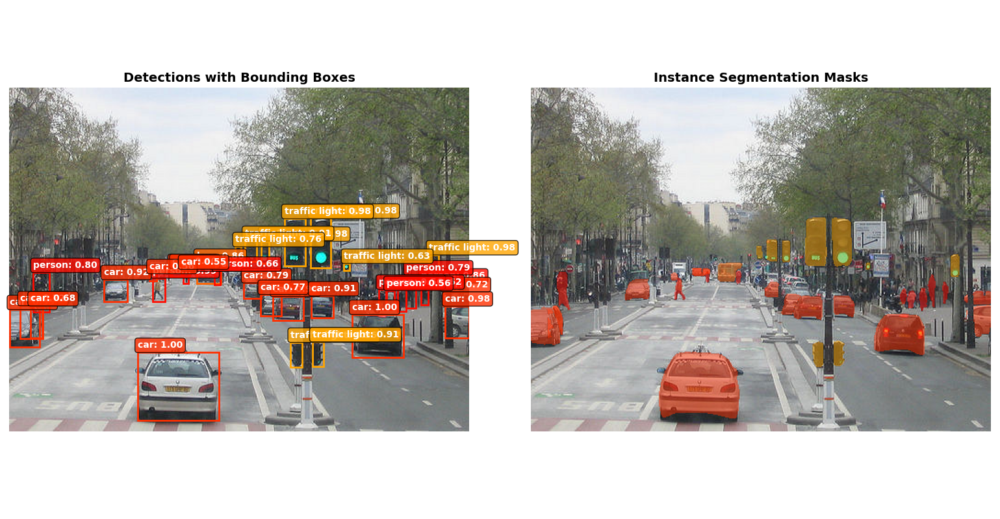

# AI-Powered Identification of Manatees

## Overview
Traditional tracking methods for marine animals, such as attaching transmitters, are often invasive, expensive, and difficult to scale. This project seeks to develop an AI-powered image recognition tool that can identify individual manatees based on distinctive scars, tail patterns, and skin markings. Using deep learning and generative AI, images will be processed into consistent sketches that highlight each animal’s unique features. These will be converted into numerical vectors and stored as digital IDs, along with time-stamped and geo-tagged metadata, that can be used to identify and track manatees needed to inform their conservation and population health.

> [!NOTE] 
> The [pytorch-mask-rcnn](pytorch-mask-rcnn) folder is cloned from the [multimodallearning](https://github.com/multimodallearning/pytorch-mask-rcnn) community. While the model is 8-9 years old the folder contains good documentation and images for model testing. 

## Current Updates & Goals
- Using Pytorch [Mask R-CNN](https://docs.pytorch.org/vision/stable/models/mask_rcnn.html) which is based on a Computer Vision and Pattern Recognition [paper](https://arxiv.org/abs/1703.06870)
- Looking into how the model works and what some basic outputs are.
- First outputs on pre-trained model 
- Learn more about using Mask R-CNN for instance segmentation and identification of manatees.


## Getting Started

### 1. Install Dependencies

```bash
pip install -r requirements.txt
```

### 2. Run the Demo

```bash
# Run with auto-downloaded sample manatee image
python demo_mask_rcnn.py

# Or use your own image
python demo_mask_rcnn.py path/to/your/image.jpg
```

The demo will:
- Load the pretrained Mask R-CNN model (COCO weights)
- Run instance segmentation on your image
- Display bounding boxes and segmentation masks
- Save results to `detection_output.png`

## Project Structure

```
├── demo_mask_rcnn.py    # Main demo script
├── requirements.txt     # Python dependencies
└── README.md           # This file
```

## What is Mask R-CNN?

Mask R-CNN is a deep learning model for **instance segmentation** - it can:
- Detect objects in images
- Draw bounding boxes around them
- Generate pixel-level segmentation masks

The pretrained model recognizes 91 COCO classes (people, animals, vehicles, etc.).

## Fine-tuning for Manatees

To train the model on your own manatee dataset, see the fine-tuning section at the bottom of `demo_mask_rcnn.py`. You'll need:

1. Annotated images (COCO format recommended)
2. Modify the model heads for your number of classes
3. Train on your dataset

Reference: [PyTorch Object Detection Tutorial](https://pytorch.org/tutorials/intermediate/torchvision_tutorial.html)

## References

- [Mask R-CNN Paper](https://arxiv.org/abs/1703.06870)
- [torchvision Mask R-CNN](https://pytorch.org/vision/stable/models/mask_rcnn.html)
- [Original pytorch-mask-rcnn repo](https://github.com/multimodallearning/pytorch-mask-rcnn) (legacy)
